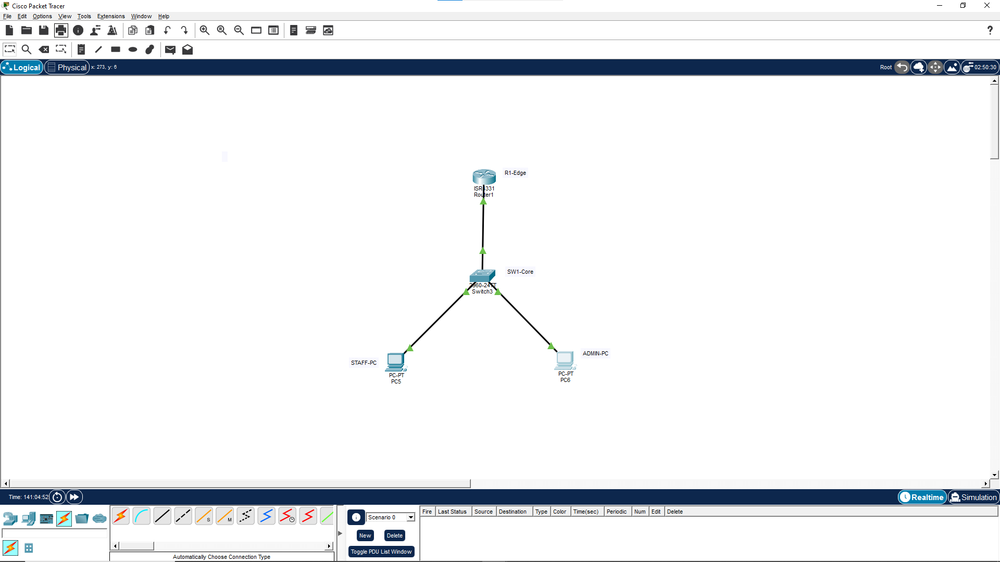
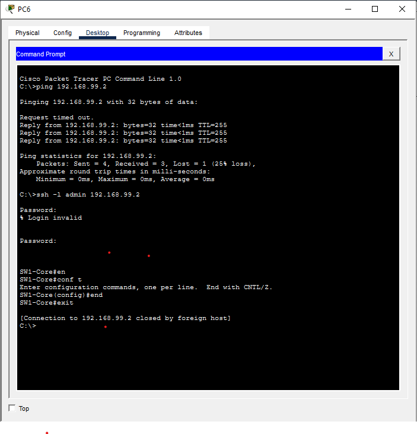

# 🏢 My Cisco Packet Tracer Lab Portfolio

Welcome to my network engineering showcase! This repository documents my practical experience in designing, configuring, and troubleshooting network infrastructures using Cisco Packet Tracer.

---

## 📐 Project 2: Enterprise Edge Secure Data Architecture

### 🖼️ Network Architecture Diagram

### 📝 Overview
This lab demonstrates a secure, high-performance corporate data architecture. It leverages a **Router-on-a-Stick (RoaS)** topology to provide efficient inter-VLAN routing while enforcing cryptographic access layers and structural Layer 2 security hardening at the access edge.

### 🛠️ Configured Protocols & Features
- **VLAN Slicing & Trunking (802.1Q):** Created logical separation for endpoints (`VLAN 10` for Staff and `VLAN 99` for Admin Management).
- **Inter-VLAN Routing:** Configured sub-interfaces on the core edge router to route traffic seamlessly across segmented domains.
- **Centralized DHCP Pooling:** Deployed an automated IP allocation engine for Staff PCs, including an authoritative external DNS pointer (`8.8.8.8`).
- **Sticky Port-Security Firewall:** Hardened station ports (`Fa0/1` and `Fa0/2`) by enforcing a strict 1-MAC limit with a violation shutdown metric to block rogue devices.
- **Cryptographic Access (SSH v2):** Disabled plain-text Telnet interfaces, restricting all remote management to secure RSA-1024 encrypted SSH sessions.
- **Rapid Convergence (Rapid-PVST+):** Optimised Spanning Tree parameters on the switch to minimize topology recalculation stabilization delays.

---

### 🔍 Verification Proofs & Live Validation
- ✅ **Dynamic Lease Validation:** Terminal nodes successfully acquire accurate addressing blocks from the centralized core router pool.
- ✅ **Cryptographic Tunneling:** VTY sessions rejected on unencrypted channels; local admin securely logs into active node via `ssh -l admin 192.168.99.2`.

#### 🖼️ Live SSH Terminal & Ping Proof:

*(Figure 2: Real-time Command Prompt verification showing successful ICMP ping matrix and secure SSH v2 encapsulation session initialization).*
